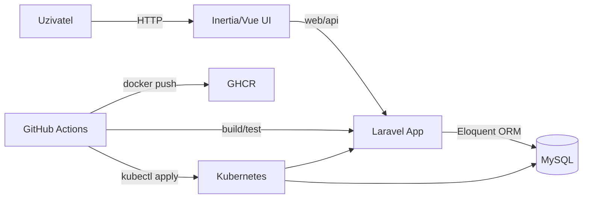

# KTDD - Systém pro půjčování knih

Semestrální projekt kombinující TDD/BDD přístup a DevOps workflow (Git, CI/CD, Docker, Kubernetes).

## 1) Doména a funkcionalita

Aplikace řeší půjčovnu knih s doménovou logikou nad entitami:

- `User` - čtenář nebo administrátor
- `Book` - kniha v katalogu
- `Rental` - výpůjčka knihy uživatelem

Hlavní business pravidla:

1. Uživatel může mít současně max. 3 aktivní výpůjčky.
2. Knihu nelze půjčit, pokud má aktivní výpůjčku jiný uživatel.
3. Uživatel s výpůjčkou po termínu nemůže půjčovat další knihy.
4. Vracet lze jen aktuálně půjčenou knihu.
5. Půjčení stejné knihy stejným uživatelem je idempotentní (nevzniká duplicitní aktivní záznam).

## 2) Architektura

### Komponenty

- Laravel aplikace (`app/Http/Controllers`, `app/Services`, `app/Models`)
- MySQL databáze (`rentals`, `books`, `users`)
- Frontend (Inertia.js + Vue)
- CI/CD přes GitHub Actions (`.github/workflows/ci.yml`)
- Kubernetes manifesty (`k8s/base`, `k8s/overlays/staging`, `k8s/overlays/production`)

### Diagram komponent a toku dat



## 3) Testovací strategie

- `Unit` testy (`tests/Unit`) pokrývají doménová pravidla a hraniční stavy.
- `Feature` testy (`tests/Feature`) pokrývají integraci controller-service-DB, autorizaci a API odpovědi.
- `Javascript` testy (`tests/Javascript`) pokrývají UI chování a používají test doubles (`vi.mock`).

Příklady:

- idempotence výpůjčky: `tests/Unit/RentalServiceTest.php`
- role-based access: `tests/Feature/AdminAccessTest.php`
- API error handling: `tests/Feature/RentalApiTest.php`

## 4) Lokální spuštění

Požadavky: Docker + Docker Compose.

```bash
git clone <repo-url>
cd KTDD
cp .env.example .env
# nastavte DB proměnné v .env (DB_CONNECTION=mysql, DB_HOST=db, DB_DATABASE=ktdd, DB_USERNAME=ktdd_user, DB_PASSWORD=<silne-heslo>)
docker compose up -d --build
docker compose exec app composer install
docker compose exec app php artisan key:generate
docker compose exec app php artisan migrate
```

Spuštění testů:

```bash
docker compose exec app php artisan test
npx vitest run
```

## 5) CI/CD

Workflow: `.github/workflows/ci.yml`

CI (push/PR):

- build prostředí
- statická kontrola (`pint`)
- unit + integration testy (PHPUnit)
- frontend testy (Vitest)
- coverage report (`coverage.xml`) + test report (`junit.xml`) jako artefakty

CD:

- build a push Docker image do GHCR
- automatický deploy na `staging` při push do `trunk`
- deploy na `production` při tagu `v*`

## 6) Docker

- `Dockerfile`: multi-stage build, non-root uživatel, healthcheck
- `docker-compose.yml`: lokální běh aplikace + nginx + mysql

## 7) Kubernetes

Struktura:

- `k8s/base` - společné manifesty
- `k8s/overlays/staging` - namespace `ktdd-staging` + staging konfigurace
- `k8s/overlays/production` - namespace `ktdd-production` + production konfigurace

Obsahuje:

- `Deployment` + `Service` pro app a DB
- `ConfigMap` pro konfiguraci
- `Secret` jako šablona (`k8s/base/secret.example.yaml`) bez reálných hodnot
- resource requests/limits a probes

Přístup k aplikaci v clusteru je řešen přes `port-forward`.

```bash
kubectl -n ktdd-staging port-forward svc/ktdd-app 9000:9000
```

## 8) Secrets a bezpečnost

- Reálné tajné hodnoty nejsou ukládány v repozitáři.
- CI/CD používá GitHub Secrets (`STAGING_DB_USERNAME`, `STAGING_DB_PASSWORD`, `STAGING_APP_KEY`, ...).
- Nasazení vytváří Kubernetes Secret za běhu přes `kubectl create secret ... --dry-run=client | kubectl apply -f -`.

## 9) Branching a release workflow

Doporučený workflow:

- feature větev (`feature/*`) -> PR -> merge do `trunk`
- hotfix větev (`hotfix/*`) -> PR -> merge do `trunk`
- release tag `vX.Y.Z` spouští production deploy job
